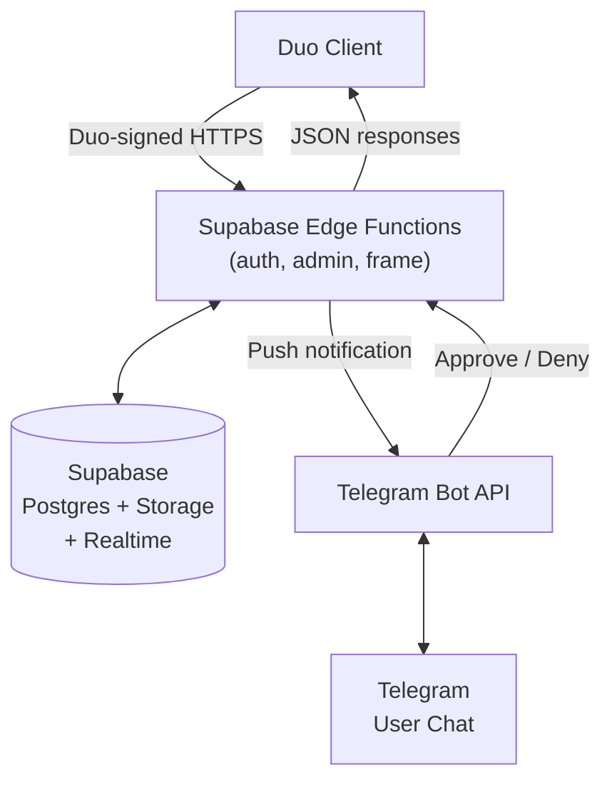

# TeleDuo

**Duo Security–compatible 2FA server that delivers push notifications via Telegram.**

TeleDuo replaces Duo Mobile with a Telegram bot — users approve or deny login requests right inside a Telegram chat. It speaks the same API as Duo's Auth and Admin services, so any application that already integrates with Duo (e.g. [Authentik](https://goauthentik.io), [Pangolin](https://github.com/fosrl/pangolin), or custom integrations) can use TeleDuo as a drop-in backend without any client-side changes.

> [!NOTE]
> This project was entirely vibe-coded from start to finish. It was built out of a simple desire to have Duo-style 2FA push notifications delivered straight into Telegram when logging in to Authentik — without needing Duo Mobile or a Duo subscription.

https://github.com/user-attachments/assets/8fd67a24-4090-4f8b-980c-0d0f9e727490

---

## Why Supabase (and not a self-hosted server)?

The official Duo client libraries ([Node](https://github.com/duosecurity/duo_api_nodejs), [Python](https://github.com/duosecurity/duo_client_python), [Java](https://github.com/duosecurity/duo_client_java), [Go](https://github.com/duosecurity/duo_api_golang), etc.) perform **TLS certificate pinning** against a hardcoded CA bundle. The pinned root CAs are:

| Certificate Authority |
|-|
| Amazon Root CA 1 |
| Amazon Root CA 2 |
| Amazon Root CA 3 |
| Amazon Root CA 4 |
| Starfield Services Root Certificate Authority – G2 |
| DigiCert High Assurance EV Root CA |
| DigiCert TLS ECC P384 Root G5 |
| DigiCert TLS RSA4096 Root G5 |
| GlobalSign Root R46 |
| GlobalSign Root E46 |
| GTS Root R2 |
| GTS Root R4 |
| IdenTrust Commercial Root CA 1 |
| IdenTrust Commercial Root TLS ECC CA 2 |
| Starfield Root Certificate Authority – G2 |

**Certificates from Let's Encrypt or Google Public CA are not on this list**, so a typical self-hosted server behind a reverse proxy (Caddy, Nginx + Certbot, etc.) will be rejected by every Duo client during the TLS handshake.

Supabase Edge Functions happen to be served with certificates chained to **GTS Root R4**, which is on the allowlist. This means Duo clients will happily connect without any patching or custom CA configuration. Supabase also provides a managed Postgres database, Realtime subscriptions (used for synchronous push polling), Storage (for branding logos), and `pg_cron` (for expired record cleanup) — all out of the box.

---

## Implemented APIs

TeleDuo re-implements a meaningful subset of the Duo Auth API and Admin API. Endpoints are wire-compatible: they accept the same parameters, return the same JSON shapes, and verify HMAC signatures exactly like the real Duo servers do (V2 + V5 canonicalization, HMAC-SHA1/SHA512, timing-safe comparison).

### Auth API (`/auth/v2/…`)

| Method | Endpoint | Description | Conformance |
|--------|----------|-------------|-------------|
| `GET` | `/auth/v2/ping` | Liveness check (no auth) | ✅ Full |
| `GET` | `/auth/v2/check` | Credential validation | ✅ Full |
| `POST` | `/auth/v2/enroll` | Create user + activation link | ✅ Full |
| `POST` | `/auth/v2/enroll_status` | Check enrollment progress | ✅ Full |
| `POST` | `/auth/v2/preauth` | Determine user readiness, return devices | ✅ Full |
| `POST` | `/auth/v2/auth` | Trigger push notification (async & sync modes) | ⚠️ `push` and `auto` factors only |
| `GET` | `/auth/v2/auth_status` | Poll transaction result | ✅ Full |
| `GET` | `/auth/v2/logo` | Serve branding logo | ✅ Full |

> The `/auth` endpoint only supports `factor=push` and `factor=auto`. Other Duo factors (`passcode`, `sms`, `phone`) are not implemented since Telegram push is the whole point.

### Admin API (`/admin/v1/…`)

| Method | Endpoint | Description | Conformance |
|--------|----------|-------------|-------------|
| `GET` | `/admin/v1/users` | List / filter / paginate users | ⚠️ Subset of filters |
| `GET` | `/admin/v1/users/:user_id` | Retrieve single user | ✅ Full |
| `DELETE` | `/admin/v1/users/:user_id` | Delete user + cascade | ✅ Full |
| `GET` | `/admin/v1/branding` | Get branding settings | ⚠️ Only `logo` field is functional; other fields (`background_img`, `card_accent_color`, `page_background_color`, `powered_by_duo`, `sso_custom_username_label`) return placeholder values |
| `POST` | `/admin/v1/branding` | Modify branding settings | ⚠️ Only `logo` upload/delete is implemented |

### Frame / Utility

| Method | Endpoint | Description |
|--------|----------|-------------|
| `GET` | `/frame/qr?value=…` | Generate QR code PNG |
| `GET` | `/frame/portal/v4/enroll?code=…` | Portal self-enrollment page |

### Telegram Bot

| Interaction | Description |
|-------------|-------------|
| `/start <activation_code>` | Link Telegram account to a TeleDuo user |
| Inline buttons **Approve** / **Deny** | Respond to push authentication requests |

The bot supports **English**, **Russian**, and **Ukrainian** locales, automatically matching the user's Telegram language.

---

## Architecture at a Glance



---

## Deployment

### Prerequisites

- A [Supabase](https://supabase.com) project (free tier works)
- [Supabase CLI](https://supabase.com/docs/guides/cli/getting-started) installed
- A Telegram bot token from [@BotFather](https://t.me/BotFather)

### 1. Clone the repository

```bash
git clone https://github.com/ky1vstar/teleduo.git
cd teleduo
```

### 2. Link to your Supabase project

```bash
supabase link --project-ref <your-project-ref>
```

### 3. Push the database schema

```bash
supabase db push
```

This creates the required tables (`users`, `devices`, `enrollments`, `portal_enrollments`, `auth_transactions`), enables Realtime on `auth_transactions`, creates the `branding` storage bucket, and schedules the expired-record cleanup cron job.

### 4. Set secrets

Generate integration keys and secret keys yourself — they can be any string, for example:

```bash
# Generate a random integration key
openssl rand -hex 20

# Generate a random secret key
openssl rand -hex 40
```

Then set them as secrets:

```bash
supabase secrets set \
  AUTH_IKEY="<your Auth integration key>" \
  AUTH_SKEY="<your Auth secret key>" \
  ADMIN_IKEY="<your Admin integration key>" \
  ADMIN_SKEY="<your Admin secret key>" \
  TELEGRAM_BOT_TOKEN="<your Telegram bot token>" \
  TELEGRAM_WEBHOOK_SECRET="<random string for webhook verification>"
```

| Secret | Description |
|--------|-------------|
| `AUTH_IKEY` | Integration key for the Auth API — used by your application to authenticate |
| `AUTH_SKEY` | Secret key for the Auth API — used for HMAC signature verification |
| `ADMIN_IKEY` | Integration key for the Admin API |
| `ADMIN_SKEY` | Secret key for the Admin API |
| `TELEGRAM_BOT_TOKEN` | Bot token from @BotFather |
| `TELEGRAM_WEBHOOK_SECRET` | Arbitrary secret string — Telegram sends it in the `X-Telegram-Bot-Api-Secret-Token` header so the function can reject forged updates |

> **Optional:** `ENROLL_ALLOW_EXISTING=true` — allow re-enrollment of already-existing users.

### 5. Deploy Edge Functions

```bash
supabase functions deploy auth
supabase functions deploy admin
supabase functions deploy frame
supabase functions deploy telegram-webhook
```

### 6. Register the Telegram webhook

```bash
curl -X POST "https://api.telegram.org/bot<TELEGRAM_BOT_TOKEN>/setWebhook" \
  -d "url=https://<project-ref>.supabase.co/functions/v1/telegram-webhook" \
  -d "secret_token=<TELEGRAM_WEBHOOK_SECRET>"
```

### 7. Configure your Duo client

Point your application (Authentik, etc.) to TeleDuo instead of Duo's servers:

| Setting | Value |
|---------|-------|
| API Hostname | `<project-ref>.functions.supabase.co` |
| Integration Key | The value of `AUTH_IKEY` |
| Secret Key | The value of `AUTH_SKEY` |

That's it — login requests will now be delivered to Telegram.

---

## Local Development

```bash
# Start Supabase locally
supabase start

# Serve Edge Functions
supabase functions serve

# In a separate terminal — expose local instance via ngrok
# and register the Telegram webhook automatically
./bin/set-tg-ngrok-webhook.sh
```

Create `supabase/functions/.env.local` with the same variables listed above. The local dev seed (`supabase/seed.sql`) overrides the cleanup cron to run every 5 minutes for faster iteration.

### Running tests

```bash
deno test supabase/functions/tests/
```

---

## License

This project is provided as-is for personal and educational use.
